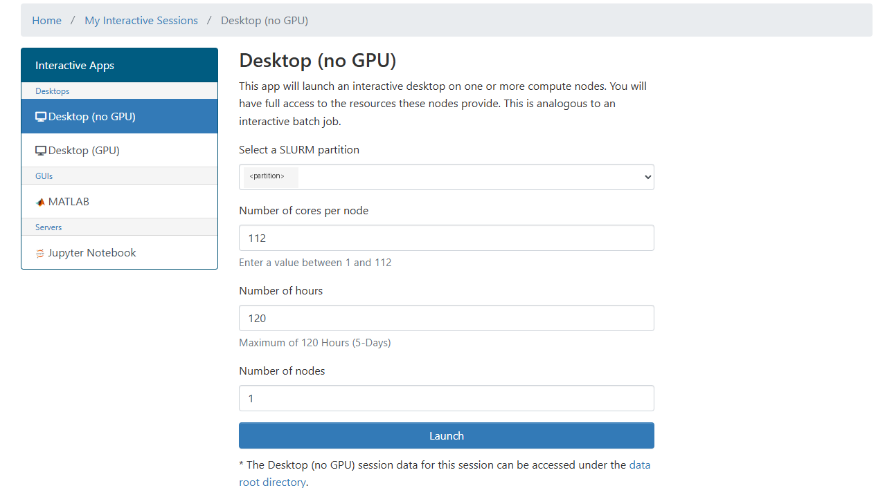
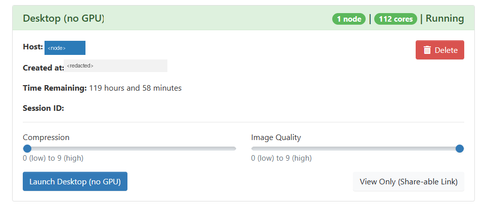
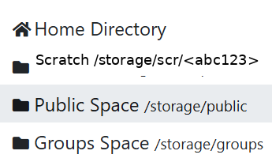

# 02 Open OnDemand

Open OnDemand (OOD) provides browser-based interactive sessions that run as standard SLURM jobs.

## 1. Launch an Interactive Session

From your OOD dashboard:

1. Choose an app type (Desktop, Terminal, Jupyter, etc.).
2. Select resources (partition, cores, memory, wall time).
3. Submit and wait for the session to start.

Use conservative resource requests first to reduce queue wait time.

Illustrative example (sanitized):



This screenshot is illustrative only. Labels and default values vary by institution.

## 2. CPU vs GPU Sessions

- CPU workflows: use desktop/terminal sessions on a CPU partition.
- GPU workflows: launch a GPU-capable session and request GPUs explicitly.

If you request GPUs inside a CPU-only allocation, SLURM will reject the step.

## 3. Map OOD Session to SLURM Job ID

Most OOD interfaces show the SLURM job ID directly. You can also discover it from SSH:

```bash
squeue -u "$USER" -o "%.18i %.30j %R" | egrep -i "desktop|ondemand|jupyter"
```

Sanitized session card example:



Host and session metadata are redacted. Treat this as a UI reference, not a policy source.

## 4. Attach from SSH to an Existing OOD Allocation

```bash
JOBID=<jobid>
srun --pty --overlap --jobid="$JOBID" /bin/bash -l
```

Use `/bin/bash` explicitly for portability inside allocations.

## 5. Confirm You Are on the Allocated Node

```bash
hostname
whoami
```

The hostname should match your compute allocation, not the login node.

## 6. Common Paths in OOD File Browser

- Home: `/home/<username>` or site equivalent
- Scratch: `/scratch/<username>` or site equivalent
- Group/project space: `/groups/<group>` or site equivalent
- Public/shared space: site-specific path

Keep large datasets and environments out of Home unless your site policy allows it.

Sanitized storage shortcuts example:


