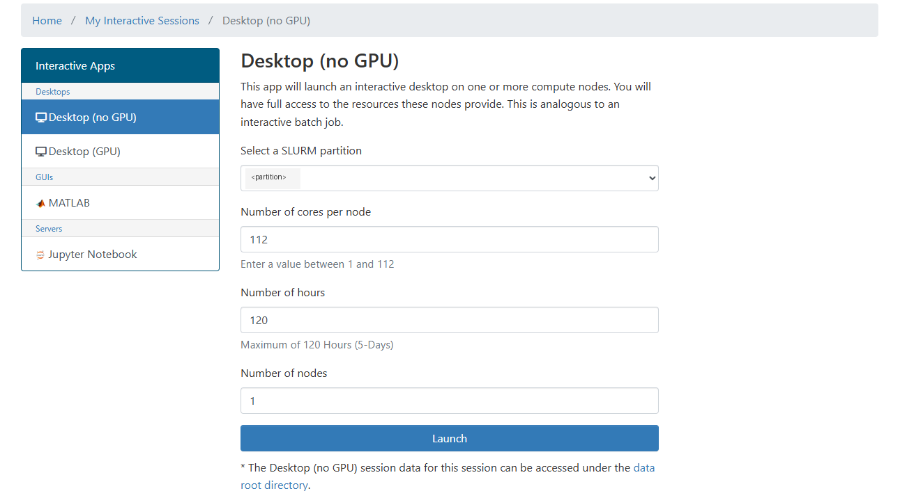
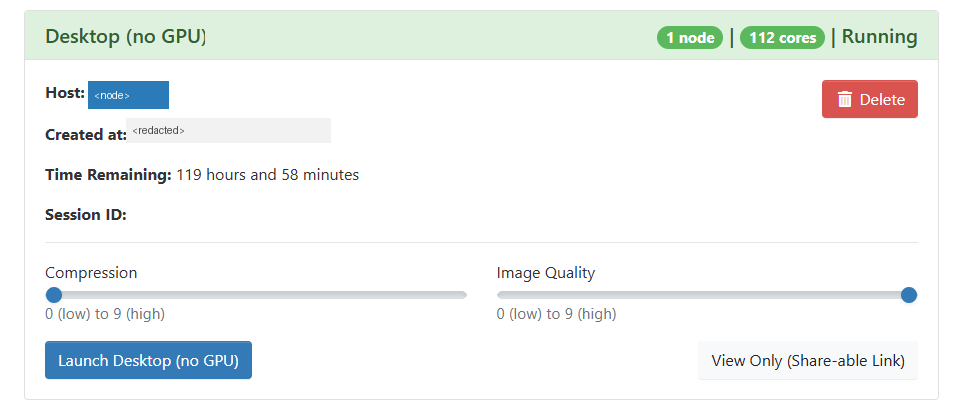
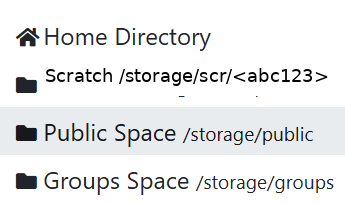

# 02 Open OnDemand

Open OnDemand (OOD) provides browser-based interactive sessions that run as standard Slurm jobs.

## 1. Launch an Interactive Session

From your OOD dashboard:

1. Choose an app type (Desktop, Terminal, Jupyter, etc.).
2. Select resources (partition, cores, memory, wall time).
3. Submit and wait for the session to start.

Use conservative resource requests first to reduce queue wait time.

Illustrative example (sanitized):



This screenshot is illustrative only. Labels and default values vary by institution.

## 2. CPU vs GPU Sessions

- CPU workflows: use desktop/terminal sessions on a CPU partition.
- GPU workflows: launch a GPU-capable session and request GPUs explicitly.

If you request GPUs inside a CPU-only allocation, Slurm will reject the step.

## 3. Map OOD Session to Slurm Job ID

Most OOD interfaces show the Slurm job ID directly. You can also discover it from SSH:

```bash
squeue -u "$USER" -o "%.18i %.30j %R" | egrep -i "desktop|ondemand|jupyter"
```

Sanitized session card example:



Host and session metadata are redacted. Treat this as a UI reference, not a policy source.

## 4. Launch a Diagnostic Shell Inside an Existing OOD Allocation

```bash
JOB_ID="REPLACE_WITH_JOB_ID"
srun --pty --overlap --jobid="$JOB_ID" /bin/bash -l
```

This starts a new Slurm job step under the existing allocation. It does not
attach to the running Desktop, Jupyter kernel, terminal, or another process.
The `--overlap` option lets the new step share the allocation's CPUs, memory,
and generic resources with other steps. Keep this shell lightweight and use it
for diagnostics so it does not compete materially with the OOD workload.

Use `/bin/bash` explicitly for portability inside allocations. Confirm that
your site permits user-launched steps inside OOD jobs.

## 5. Confirm You Are on the Allocated Node

```bash
hostname
whoami
```

The hostname should match your compute allocation, not the login node.

## 6. Common Paths in OOD File Browser

- Home: `<home-path>`
- Scratch: `<scratch-path>`
- Group/project space: `<project-path>`
- Public/shared space: site-specific path

Keep large datasets out of Home unless site policy allows them there. Put
environments that must survive scratch purges in site-approved persistent
project/software storage. Use scratch for an environment only when local
retention and software-placement policies support it and the environment is
rebuildable.

Sanitized storage shortcuts example:


